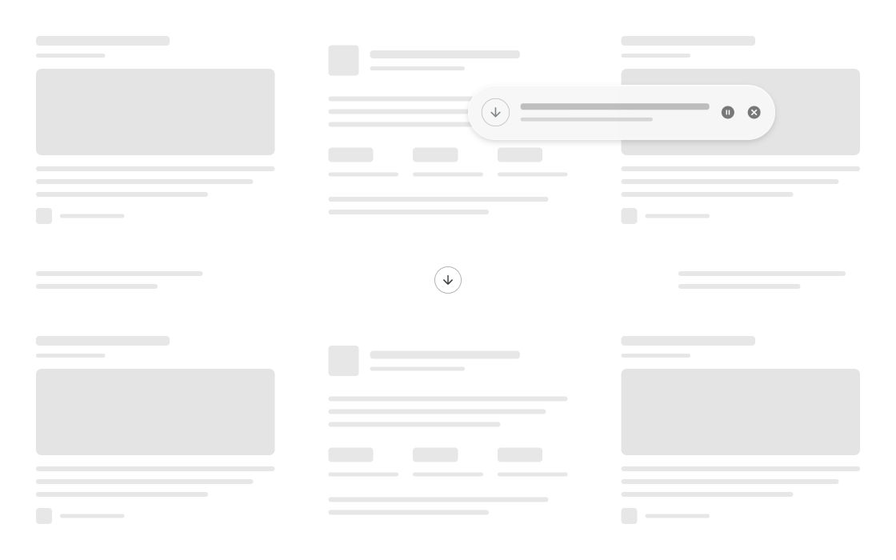

# Dia download animation recreation

Interactive recreation of [Dia](https://www.diabrowser.com/)'s download animation. A card lifts, changes speed and scale, and collapses into a download button while the page dims and bends around a soft light trail.

[Live demo](https://mark-x64.github.io/dia-download-animation-recreation-with-codex/)



[MP4 preview](docs/preview.mp4) · [Motion](src/useCardMotion.jsx) · [Refraction shader](src/fluidShader.js)

## Run

Requires Node.js 20.19+ and a browser with WebGL.

```sh
npm ci
npm run dev
```

Drag the card and release it to collect it. A fast throw carries momentum, bounces at the edge, and then returns to the button. The card can be grabbed again while it is moving. After collection, it reappears at a different random position.

Click the download button to collect the card directly. Hold **Shift** when releasing or clicking for slow playback. When the card has keyboard focus, use the arrow keys to move it and **Enter** or **Space** to collect it.

```sh
npm run build
npm run preview
```

The build uses relative asset paths and can be served from a repository subdirectory. The default branch is published automatically to GitHub Pages; see [deployment setup](docs/pages.md) for this and future recreation projects. The skeleton layout rearranges for wide, tablet, and phone viewports, leaving space around the button.

## How it works

[Motion](https://motion.dev/) handles dragging, inertia, and animation values. The position, scale, rotation, and opacity landmarks in `src/referenceMotion.js` reconstruct the collection sequence. The trajectory is mapped from any release position to the current button center. A separate, cancellable timer handles the next random appearance.

[Material UI](https://mui.com/material-ui/react-skeleton/) provides the static skeleton background. `html-to-image` captures that layer on initialization and layout changes. An [OGL](https://github.com/oframe/ogl) shader samples the resulting texture with local displacement and slightly separated RGB coordinates, producing refraction and dispersion. A short motion history carries the white glow behind the card.

The card and button remain interactive DOM elements. Rendering runs while the effect is active and stops when the scene settles or the page is hidden. There is no backend, reference video, or external media loaded at runtime.

This is an independent visual reconstruction, not Dia's original implementation.

## Credits and license

By [mark-x64](https://github.com/mark-x64), developed with [OpenAI Codex](https://openai.com/codex/).

Original code and documentation: [MIT](LICENSE). Dependencies and icon artwork retain their own licenses; see [third-party notices](THIRD_PARTY_NOTICES.md).
